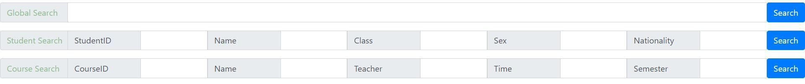

# 搜索功能(search)


## 功能说明

#### 搜索范围

提供两种表的搜索功能：学生表的基本信息（可公开信息）和开课表

#### 搜索功能实现目的

1. 在不确定表项的值的情况下，通过关键字进行模糊查询

2. 通过多个表项的组合信息对表进行筛选，例如查询春季学期的周五的所有课
3. 简单快捷的查询功能

#### 搜索方法

提供三种搜索方法：全局搜索，学生表搜索（组合信息），课程表搜索（组合信息）



全局搜索：对学生表和课程表搜索

学生表搜索：输入已知表项信息（可选），对学生表搜索

课程表搜索：输入已知表项信息（可选），对开课表搜索

点击search后会在相应的table显示搜索信息


## 代码实现

#### 全局搜索(global_search)

前端发送搜索关键字'global_info'传入后端

```python
global_info=""
if request.method == "GET":
   global_info = request.GET.get('global_info').strip()
```

后端对学生表和开课表模糊查询，django中的__contains=”xxxxx“对应于sql中的LIKE%xxxxx%，由于不确定表项所以对每个可查询的表项进行搜索，用或词'|'连接，这样不论哪个表项包含关键字都能被搜索到。(例如学生表中)

```python
stu_list = Student.objects.filter(Q(name__contains=global_info) | Q(student_id__contains=global_info)| Q(myClass__name__contains=global_info) | Q(nationality__contains=global_info))
```

最后将stu_list和cou_list传到前端显示即可

#### 学生表搜索和课程搜索(stu_search和cou_search)

两个搜索实现方式十分相似，以课程搜索为例，前端将每个表项所填的关键字传入后端

```python
if request.method == "GET":
	CourseID = request.GET.get('CourseID').strip()
	CourseName = request.GET.get('CourseName').strip()
	CourseTeacher = request.GET.get('CourseTeacher').strip()
	CourseTime = request.GET.get('CourseTime').strip()
	CourseSemester = request.GET.get('CourseSemester').strip()
```

后端对开课表搜索，允许有表项不填，所以判断一下只有有一个表项内容不为空，则搜索。依然使用django中的__contains进行模糊查询，由于这里是组合信息，所以用与词'&'连接更好，这样只会搜索到包含所有已填表项内容的课程。

```python
if CourseID or CourseName or CourseTeacher or CourseTime or CourseSemester:
    cou_list = ValidLesson.objects.filter(Q(lesson__id__contains=CourseID) & Q(lesson__name__contains=CourseName) & Q(teacher__name__contains=CourseTeacher) & Q(begin_time__contains=CourseTime) & Q(begin_semester__contains=CourseSemester))
```

学生表搜索十分相似，不再赘述。

## 运行截图

全局搜索'liwu',显示了所有包含liwu关键词的学生信息和课程信息


以学生表搜索为例在学生表搜索性别为男，国籍为中国的学生

